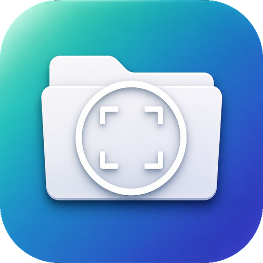
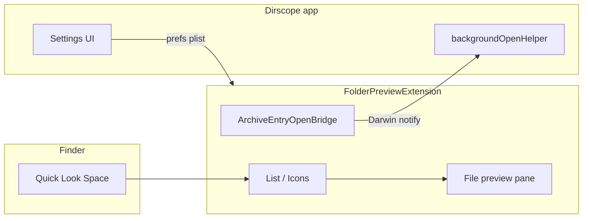

<div align="center">



<br>

# Dirscope

### Folder previews, built for Finder.

Browse folders and archives inside **Quick Look** — no extra window, no full extraction.

Press **Space** or **⌘Y** on any folder or archive in Finder.

<br>

[](https://www.apple.com/macos/)
[](https://swift.org/)
[](LICENSE)
[](https://github.com/NehangPatel23/dirscope/releases)

<br>

[Download latest release](https://github.com/NehangPatel23/dirscope/releases) · [Build from source](#build-from-source) · [Developer guide](docs/DEVELOPMENT.md) · [Fine print](#fine-print)

</div>

---

## At a glance

| | |
|---|---|
| **What it is** | A native macOS host app + **Quick Look extension** that replaces Finder’s plain folder icon with a full file browser |
| **What you get** | Sortable lists, icon grids, expandable trees, archive browsing, and a side-panel file inspector |
| **What you don’t need** | Dirscope’s window open while previewing — Quick Look runs in the extension |
| **Open source** | MIT license · built from scratch in Swift, SwiftUI, AppKit, and Quick Look |

```
  Finder                    Quick Look panel
  ──────                    ─────────────────────────────────────────
  📁 My Project  ──Space──►  [ List │ Icons ]  path › … › src
                             ┌──────────────────┬─────────────────────┐
                             │ ▾ src            │  preview pane       │
                             │   ▾ components   │  (text, image, QL)  │
                             │     Button.swift │                     │
                             └──────────────────┴─────────────────────┘
```

---

## Features

### Quick Look — folders

| Feature | Details |
|---------|---------|
| **List & icon views** | Switch with the footer control; default is configurable |
| **Sortable columns** | Click headers to sort; optional columns via right-click |
| **Expandable tree** | Disclosure chevrons on folders; optional auto-expand with depth limit (1–7) |
| **Hidden files** | Optional dotfile display (`.gitignore`, `.env`, …) |
| **Folder-first sort** | Optional grouping of directories above files |
| **Path breadcrumb** | Footer bar showing current location (toggle in settings) |
| **Zoom** | Footer slider scales row height and icon grid size |
| **File type icons** | Every name row shows the correct Finder-style icon |
| **Light / dark mode** | List, inspect panel, and footer follow system appearance live |

**Available columns** (right-click any header to toggle):

| Column | Shows |
|--------|--------|
| Name | File or folder name + icon (always visible) |
| Modified | Content modification date |
| Created | Creation date |
| Last Opened | Content access date |
| Added | Date added to parent folder |
| Size | File size (human-readable) |
| Type | Uniform Type localized description |
| Resolution | Pixel dimensions for images |

Default visible columns: **Name**, **Modified**, **Size**, **Type**.

---

### Quick Look — archives

Open archives in Quick Look like folders — browse without extracting the whole file.

| Format | Listing | Metadata (size / date) | Side-panel preview | Open in default app |
|--------|---------|------------------------|--------------------|---------------------|
| **`.zip`** | In-process | Per entry + folder aggregates | Yes | Yes (background helper) |
| **`.tar`** | In-process | Per entry + folder aggregates | Yes | Yes |
| **`.tar.gz` / `.tgz`** | In-process (gzip + tar) | Yes | Yes | Yes |
| **`.tar.xz`** | In-process (xz + tar) | Yes | Yes | Yes |
| **`.gz`** (single file) | Single implicit entry | — | Yes | Yes |
| **`.7z`** | Via bundled `7zz` | Limited | Yes | Yes |
| **`.rar`** | Via bundled `7zz` | Limited | Yes | Yes |

**Archive behaviors**

- **Nested folders** — expand with chevrons inside the archive list
- **Nested archives** — `.zip` inside `.zip` browsable as containers
- **Single-root strip** — if every entry lives under one top folder, that wrapper is skipped
- **Sandbox-safe I/O** — coordinated reads + cached bytes in the extension container
- **Zip cache** — archive data and parsed listings cached by path, size, and modification time
- **Background extract** — only the selected entry is extracted for preview or open (never the full archive)

**Opening a file inside an archive**

1. Extension extracts **one** entry to a staging folder  
2. A pending-open plist is written  
3. A headless **background helper** (LaunchAgent) opens the file via Launch Services  

Double-click, **Return**, or the side-panel **Open** button all use this path. Reinstall with `./install-app.sh` if opens stop working. Status is shown under **Behaviors → Archive file opens**.

---

### Side-panel file preview

Click any file in the list to inspect it on the right.

| Content type | Behavior |
|--------------|----------|
| **Plain text & code** | Monospaced source view; 512 KB cap with truncation notice |
| **Dotfiles & config** | `.gitignore`, `.dockerignore`, `.env*`, `.prettierrc`, `Dockerfile`, `Makefile`, … |
| **Code extensions** | `.swift`, `.py`, `.dart`, `.ts`, `.rs`, `.go`, `.java`, `.kt`, … (see `InlineFilePreviewLoader`) |
| **Markdown** | Source / Formatted toggle |
| **HTML** | Source / Formatted toggle; staged base URL for archive entries |
| **SVG** | Rendered image when possible |
| **Images** | Decoded on a background thread, scaled to fit (not SVG) |
| **PDF, video, audio, …** | Quick Look fallback when inline preview isn’t available |
| **Folders** | Placeholder — use list chevrons to navigate |
| **Archive containers** | Placeholder — use chevrons to browse |

Archive entries reuse extracted bytes for Quick Look and HTML base URLs (no double extraction).

---

### Host app (Dirscope)

The menu-bar app is for **onboarding, settings, and extension setup** — not required during normal Quick Look use.

| Section | Purpose |
|---------|---------|
| **Dashboard** | Quick-start overview |
| **Introduction** | What Dirscope does, archives, background helper |
| **Quick Look** | Usage tips while previewing |
| **Extension** | Step-by-step System Settings enablement |
| **Appearance** | Default view, text size (S / M / L), path breadcrumb |
| **Behaviors** | Hidden files, folder-first sort, auto-expand, nesting depth, helper status |
| **About** | Capabilities summary |
| **⌘, Settings** | Same Appearance & Behaviors panes |

**Settings sync** — preferences live in the extension container plist; changes apply live in Quick Look via Darwin notifications (no relaunch).

---

## Install

### Option A — GitHub release (pre-built)

1. Download **`Dirscope-x.y.z.zip`** from [Releases](https://github.com/NehangPatel23/dirscope/releases)
2. Move **`Dirscope.app`** to **`/Applications`**
3. **First open** — see [Gatekeeper](#gatekeeper-ad-hoc-builds) below if macOS blocks the app
4. Open Dirscope once (registers background helper)
5. **System Settings → General → Login Items & Extensions → Quick Look** → enable **Dirscope**
6. In Finder: select a folder → **Space** or **⌘Y**

### Option B — Build from source (recommended for developers)

```bash
git clone https://github.com/NehangPatel23/dirscope.git
cd dirscope
./install-app.sh
```

`install-app.sh` builds, installs to `/Applications`, reloads Quick Look, and registers the LaunchAgent.

```bash
./install-app.sh --no-open --skip-icons   # rebuild without opening app or regenerating icons
```

Optional: `./scripts/fetch-7zz.sh` before install for sandboxed **7z/rar** support (copied into app Resources).

### Option C — Xcode

1. Open `FolderPreviewApp.xcodeproj`
2. Scheme: **FolderPreviewApp** → **⌘R**
3. Enable the extension in System Settings (as above)

---

## Fine print

> Read this section if you download binaries, care about legal clarity, or wonder why macOS warns about the app.

### Gatekeeper (ad-hoc builds)

Dirscope is **not notarized** and is **not signed with a paid Apple Developer ID**. Release builds use ad-hoc / “Sign to Run Locally” signing.

**You may see:** *“Dirscope can’t be opened because Apple cannot check it for malicious software.”*

**To install anyway:**

1. **Right-click** `Dirscope.app` → **Open** → confirm, **or**
2. **System Settings → Privacy & Security → Open Anyway** after the first blocked attempt

This is normal for independent open-source Mac apps distributed outside the App Store without a $99/year Apple Developer Program membership. **We do not notarize** — by design, to avoid that cost.

### No Apple Developer account

| Available without $99/year | Requires paid Apple Developer Program |
|----------------------------|----------------------------------------|
| Build and run on your Mac | Mac App Store distribution |
| Ad-hoc GitHub release zip/dmg | Notarization & “identified developer” |
| Quick Look extension (local) | App Group entitlements (optional prefs sync) |
| Open-source distribution | Smooth install for strangers with zero warnings |

**Recommended path without a developer account:** build from source with `./install-app.sh`, or download the release and use Right-click → Open.

### Independence & inspiration

Dirscope is an **independent, open-source project**. It is **not affiliated with, endorsed by, or derived from** any commercial product.

The **idea** of previewing folder contents from Finder Quick Look was inspired by the general concept popularized by third-party macOS utilities, including [Folder Preview on the Mac App Store](https://apps.apple.com/us/app/folder-preview/id6698876601?mt=12). Dirscope was **built from scratch** in Swift using Apple’s Quick Look APIs. It does not include, copy, or reverse-engineer code, assets, or UI from that app or any other commercial product.

### Third-party components

| Component | Use | License |
|-----------|-----|---------|
| **7-Zip (`7zz`)** | Optional bundled binary for `.7z` / `.rar` | [GNU LGPL](https://www.7-zip.org/license.txt) — see [`Vendor/README.md`](Vendor/README.md) |
| **Apple frameworks** | Quick Look, AppKit, SwiftUI | Apple SDK terms |

### Privacy

Dirscope runs locally. It does not upload folder contents or analytics to any server. Preferences and staged archive files stay on your Mac (extension container and temp directories).

### Limitations

- No syntax highlighting in source preview (plain monospaced text)
- Complex HTML in archives may need a browser; external assets are not fetched
- `.zip` files inside normal folders are not expandable as containers (only inside archive browse mode)
- App Group entitlements are not used; prefs sync via explicit container path
- Quick Look extension is sandboxed; archive opens depend on the background helper

---

## Usage cheat sheet

| Action | How |
|--------|-----|
| Open preview | Select folder or archive in Finder → **Space** or **⌘Y** |
| List / Icons | Footer segmented control |
| Expand folder | Click chevron in Name column |
| Preview file | Single-click in list |
| Open file | Double-click (or **Return** for archive entries) |
| Open from archive | Double-click, **Return**, or side-panel **Open** |
| Toggle columns | Right-click column header |
| Change settings | Dirscope → **Configure** or **⌘,** |

---

## Build from source

```bash
xattr -cr .                    # if codesign complains about "resource fork"
./install-app.sh
```

Manual build:

```bash
xcodebuild -project FolderPreviewApp.xcodeproj \
  -scheme FolderPreviewApp \
  -derivedDataPath ./DerivedData \
  build
```

### Release artifacts (optional)

```bash
./scripts/fetch-7zz.sh                    # optional 7z/rar support
./scripts/release-build.sh --skip-notarize  # writes dist/Dirscope-VERSION.zip
```

Outputs: `dist/Dirscope-VERSION.zip`, `.dmg`, and `RELEASE-VERSION.md`.

Notarization (`DEVELOPMENT_TEAM`, `NOTARY_PROFILE`) is **optional** and requires a paid Apple Developer account. This project targets **ad-hoc** releases by default.

Publish to GitHub:

```bash
gh release create v1.0.0 dist/Dirscope-1.0.0.zip dist/Dirscope-1.0.0.dmg \
  --notes-file dist/RELEASE-1.0.0.md
```

---

## Troubleshooting

| Problem | Fix |
|---------|-----|
| macOS won’t open the app | [Gatekeeper](#gatekeeper-ad-hoc-builds): Right-click → Open |
| Default folder icon in Quick Look | Close panel → `qlmanage -r` → `killall Finder` |
| Extension failed during preview | `./install-app.sh` → `killall Finder` |
| Archive list empty | Rebuild; ensure archive is readable |
| Archive open does nothing | `./install-app.sh`; check **Behaviors → Archive file opens**; `pgrep -fl backgroundOpenHelper` |
| Settings not updating | Close and reopen Quick Look |
| Codesign “resource fork… detritus” | `xattr -cr DerivedData` then rebuild (`install-app.sh` clears this automatically) |
| Extension missing in Settings | Reinstall; verify `Dirscope.app/Contents/PlugIns/FolderPreviewExtension.appex` |

Inspect preferences:

```bash
plutil -p ~/Library/Containers/com.folderpreview.app.preview/Data/Library/Application\ Support/Dirscope/Preferences.plist
```

---

## Architecture



**Bundle IDs:** `com.folderpreview.app` (host) · `com.folderpreview.app.preview` (extension)

**Prefs path:**

`~/Library/Containers/com.folderpreview.app.preview/Data/Library/Application Support/Dirscope/Preferences.plist`

---

## Development

See **[docs/DEVELOPMENT.md](docs/DEVELOPMENT.md)** for project layout, architecture, `install-app.sh` internals, release signing, key source files, and contributor workflow.

---

## License

MIT License — see [LICENSE](LICENSE).

---

<div align="center">

**Dirscope** — built with Swift, SwiftUI, AppKit, and Quick Look.

Independent open source · not affiliated with Folder Preview or Apple.

</div>
